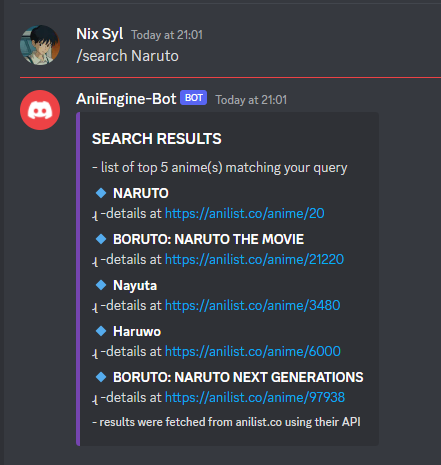

# AniEngine-Bot (a simple discord bot)
 
 This bot uses **Anilist API** to search anime titles and shows the user the output as **Embed** (of top five results), I've included **grahpql query** to get anime details (*by providing the ID*) including a sample func, implement it by yourself. 
 
 
 
 # Ref
###  API Docmentation: [https://anilist.gitbook.io/anilist-apiv2-docs/](http://https://anilist.gitbook.io/anilist-apiv2-docs/ "https://anilist.gitbook.io/anilist-apiv2-docs/")